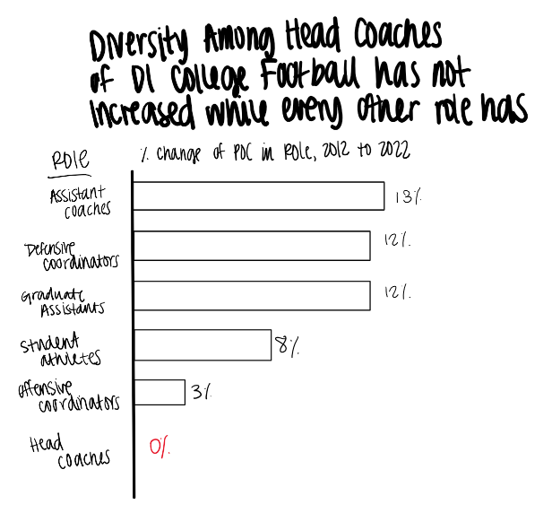

| [home page](https://bfriedel.github.io/portfolio/) | [visualizing debt](https://bfriedel.github.io/portfolio/visualizing-government-debt) | 

# Critique by Design

## Step 1: Find a Data Visualization

For this assignment, I found the following visualization:

[Source: Axios](https://www.axios.com/2023/09/02/college-football-head-coach-diversity)

This chart compares growth of diversity among different roles of D1 College Football from 2012 to 2022 in order to make the point that the role of head coach has seen no growth in diversity while every other role has. The main reason I chose this chart because I had a hard time distinguishing difference in diversity between 2012 and 2022 due to the use of a circle as the shape. 

## Step 2: Critique the Data Visualization

**Usefulness - 8/10**\
This chart caters to both football enthusiasts and those less familiar with the sport as no more context is necessary to understand what is being presented. One issue with this chart's usefulness is there may even be too much data that is being presented; the interest of the article is to highlight that head coach diversity has not changed compared to the other roles in the sport, so we do not necessarily need to see the actual percent makeup of POC each year. It could enhance its usefulness by simplifying the data presentation to focus on the difference in diversity rates between 2012 and 2022, aligning more closely with the article's primary message about lack of growth in head coach diversity.
 
**Completeness - 7/10**\
This chart is almost complete as it effectively presents the relevant data: the percentage of people of color (POC) in various roles within D1 college football in 2012 and 2022. However, it would benefit from a brief note indicating that the data does not include Historically Black Colleges and Universities (HBCUs). Including this clarification would enhance the chart's completeness by providing important context for the data's scope and ensuring that viewers have a comprehensive understanding of the information presented.
 
**Perceptibility - 3/10**\
The chart's perceptibility is low due to its use of circles to represent the percentage makeup of POC in various roles within NCAA D1 college football in 2012 and 2022. As discussed in class, human perception struggles with accurately assessing areas, making the use of circles less than ideal for presenting this data. Trying to compare the areas of circles to discern the percent change of POC in these roles is challenging and requires mental calculations from the viewer. Furthermore, the article's main goal seems to be comparing the change in POC makeup over the course of a decade, but the circular format makes this task more complicated than necessary. This chart would be more effective in conveying the percentage makeup of POC in these roles rather than focusing on the change over time.\
While the use of a shadow box around the head coach category attempts to draw attention to it, the subtlety of this design element means it may not be the viewer's initial point of focus. Improving the chart's perceptibility by using a more intuitive visual format and clearer emphasis on the key point would enhance its effectiveness in conveying the intended message.

**Truthfulness - 2/10**\
This chart receives a low score for truthfulness due to critical omissions and misleading data representation. The chart's creator excluded all Historically Black Colleges and Universities (HBCUs) from the data, which significantly impacts the accuracy and truthfulness of the representation. When HBCUs are included, the data shows that 20% of head coaches are non-white, rather than the 13% presented in the chart.\
The omission of HBCUs is a crucial qualifying factor that is not disclosed in the chart, rendering it misleading. While the decision to exclude HBCUs might align with the chart's intended message, failing to acknowledge this exclusion undermines the chart's truthfulness and transparency. Providing a note or context about the exclusion of HBCUs is essential to ensure the chart accurately represents the data and provides viewers with a complete and truthful picture of the situation.

**Intuitiveness - 4/10**\
This chart scores moderately in intuitiveness, as it presents the data in a format that, while not common, is relatively easy to understand. However, there are certain issues that reduce its overall intuitiveness.\
The chart requires viewers to perform mental calculations to understand the main point, which is the change in the percentage makeup of POC in various roles within NCAA D1 college football from 2012 to 2022. This reliance on viewer calculations reduces the chart's intuitiveness, as the primary message could be conveyed more directly. Another issue relates to the order of presentation of the categories. While the chart follows the order found on the NCAA website where the data originates, it may be more intuitive to reorganize the categories. For instance, arranging them in ascending or descending order based on percent change over time or the percentage makeup of POC in the roles in either 2012 or 2022 could make it easier for viewers to identify trends and draw comparisons.

**Aesthetics - 5/10**\
This chart's aesthetics fall in the neutral category, avoiding both being unattractive and beautiful. While it has some positive design elements, it also suffers from noticeable issues.\
Positively, the use of colors reminiscent of those found on a football field aligns with the sports theme and adds relevance to the content. Additionally, the choice of a modern and legible font enhances readability without introducing distractions.\
However, there are significant detractors from the chart's aesthetics. The underlined portions that serve as a legend appear as typos, diminishing the overall visual appeal. Inconsistent spacing between words in the title is also distracting and could benefit from more uniform formatting. Furthermore, the use of dotted lines to represent past data, although unconventional, may have been chosen to ensure accessibility for individuals with color blindness. While this consideration is essential, it is crucial to balance accessibility with visual clarity. There might be alternative methods to distinguish past data that align more closely with common knowledge and do not compromise aesthetics.
 
**Engagement - 4/10**\
The engagement level of this chart is below average as it falls short of effectively conveying the main point of the article. While the chart aims to present data related to diversity in college football roles, it does not directly emphasize the article's key message, which is the lack of progress in head coach diversity compared to other roles. Additionally, certain elements of the chart's aesthetics, such as the distracting underlined legend and inconsistent spacing, detract from the overall clarity of the message being presented. These issues hinder the viewer's ability to engage with and immediately grasp the chart's intended meaning.\
To improve engagement, the chart could benefit from a more direct visual emphasis on the central message regarding head coach diversity and a clearer visual hierarchy that guides viewers to the key takeaway. Addressing the aesthetic concerns mentioned earlier would also contribute to a more engaging and effective presentation of the data.

 
**Describe your overall observations about the data visualization here. What stood out to you? What did you find worked really well? What didn't? What, if anything, would you do differently?**\
The data visualization has several issues that hinder its effectiveness in conveying the intended message. The underlined portions in the title, meant to serve as a legend, were unclear and could be mistaken for typos, causing confusion. Additionally, the chart does not sufficiently emphasize the central message, which is the lack of progress in head coach diversity compared to other roles. To improve clarity, highlighting the change between 2012 and 2022 and providing a more direct visual emphasis on head coach diversity could enhance the chart's effectiveness. Reordering the roles in descending order by change or population could also make the chart more intuitive and engaging, helping viewers quickly identify trends and comparisons. Overall, addressing these issues would significantly improve the chart's clarity and impact. 

**Who is the primary audience for this tool? Do you think this visualization is effective for reaching that audience? Why or why not?**\
The primary audience for this tool is the casual sports fan and the average citizen. While the chart does an acceptable job in communicating the lack of diversity in different roles within college football, it falls short in properly conveying the urgency and significance of the issue. The visualization could be more impactful in highlighting the concern posed by the lack of representation in the football world. To better engage and inform the audience, it would benefit from a clearer emphasis on the lack of progress in head coach diversity compared to other roles and a more direct visual representation of the issue's importance.
 

**Final thoughts: how successful what this method at evaluating the data visualization you selected? Are there measures you feel are missing or not being captured here? What would you change? Provide 1-2 recommendations (color, type of visualization, layout, etc.)**\
The method for evaluating the data visualization is comprehensive and provides a structured approach to assessing various aspects of the chart. However some categories seem to overlap or be perceived as redundant, such as perceptibility and intuitiveness. Combining these categories into one could streamline the evaluation process and make it more straightforward.\
Additionally, including a section on whether the chosen chart type is the most suitable for presenting the data could be valuable. This would encourage critical thinking about the effectiveness of the chosen visualization method and whether alternative chart types might convey the information more clearly and effectively.

## Step 3: Sketch out a Solution

I originally sketched out two solutions, a line chart and a bar graph because I was not sure which would be better for presenting the data. I tried to sketch out a solution which included both the value of the percentage of POC, but also allowed us to better visualize the growth. While trying to include both of these, I chose a line graph. Upon testing this sketch with other people, they did not feel it properly conveyed the lack of growth in diversity of the head coaching position, which was the main point of the story.

 Once I reexamined the main intent of the visualization, which was to show the lack of growth in diversity for the head coaching position, I decided to stick with the bar chart to directly observe change in percentage POC in the roles. This visualization allows us to directly view the growth as opposed to individual values. 

## Step 4: Test the Solution

**test 1** Student, mid 20s\
I showed this person the bar graph first and they were able to identify the message I intended, which is lack of growth in the head coaching position. What they found surprising was the lack of growth and they wanted to see a couple decimal places included to know the true number. They believed the intended audience is athletic directors of colleges who are looking to hire coaches. While this was not who I believed the intended audience to be, it is a valid concern that athletic directors should be observing so i do agree with this assessment. When asked if they would do anything differently besides adding additional decimal places, they said the title could be more clear. Lastly, I showed them the line graph sketch, which they did not like because it was still difficult to directly compare growth if diversity in the categories. 

**test 1** Adult, late 50s\
When I showed this person the sketch of the bar chart, they were able to correctly identify my intended message and thought the data was interesting. When asked if there was anything they would do differently, they said spelling out POC would make it more clear, as well as shortening the title. They also wanted to know the specific values of roles filled by POC. Finally, they said 

**test 2** Adults, mid 20s\
I showed my chart to two more people because one played D1 college football. They were able to correctly identify the intended message. I was again asked what the exact population makeups were. This led to a discussion of the broader view of the topic.While this topic has been in the news often, especially recently, it is not discussed in the teams. The former player was interested in the data and thought it was interesting that they had never considered the lack of diversity in head coaches before I showed them the graph. From this discussion, I did not receive any new changes to make to the chart, but am now more interested in the impact of the NCAA's new NIL rules on the issue of diversity within sports. 

From my initial feedback, the changes I made included making a better title, using a two decimal places in the value labels, and adding a popup boxes which tells the actual percentage of POCs in each role. I used red to highlight the head coahces to draw attention to it since the bar is so small. 

**class feedback** Adults, mid 20s\
When shown my draft solution on Flourish, this group said they liked the bar chart because they could see a dramatic difference between head coaches and other categories. They also liked the title and the colors and popups. I originally added a subtitle which explained the graph and included the note about HBCUs not being included. They said that was not necessary excpet for the note about HBCUs not being included and said that information would be better in a footnote.

## Step 5: Build the Solution

My redesigned data visualization provides a direct comparison of the growth in the representation of POC across six different categories of roles in college football from 2012 to 2022. Rather than relying on the challenging perception of changes through area-based representations like circles, I opted for a bar chart. This choice was made with the intention of enhancing the viewer's understanding of the data by presenting it in a more intuitive and straightforward manner.

The categories of Head Coaches, Defensive Coordinators, Offensive Coordinators, Assistant Coaches, Graduate Assistants, and Student Athletes were sorted in descending order based on the difference in the percentage of roles filled by POC from 2012 to 2022. This sorting method helps viewers immediately identify which categories have shown the most significant changes over the decade. To further assist the audience in interpreting the data, I included value labels on each bar, making it easy to grasp the magnitude of change in each category. Additionally, I incorporated a pop-up feature that provides viewers with the actual values from 2012 and 2022 when they hover over each bar, presenting a more detailed examination of the data.

I used the color red to highlight the Head Coaches category. This was intended to draw attention to this specific group, potentially indicating a focus area or an area of concern in terms of diversity and representation. 

In conclusion, my redesigned data visualization conveys the changes in the percentage of POC occupying various roles in college football over the past decade. By using a bar chart and implementing labeling and pop-up features, I aimed to create a visualization that is both informative and accessible, allowing viewers to easily discern and understand the trends in POC representation within the chosen categories.

I first created my solution using the same data that the original creator used, which excluded HBCUs, and included a footer note which tells the viewer that this category was not included. 

### Different Data

After using the data the doing this, I decided to use the same design but include HBCUs in the data to see if it told the same story. 

Upon analysis, it became evident that the inclusion of HBCUs in the data does indeed tell a similar story, though to a slightly lesser degree. Specifically, when HBCUs are included, the percentage of POC in head coaching roles increases by 0.55%, as opposed to the 0.36% increase observed when excluding HBCUs. Additionally, the impact is less pronounced when compared to other categories. For instance, the maximum increase is still observed in assistant coaching roles, with a 10.11% increase when HBCUs are included, as opposed to an 11.89% increase when they are excluded.

Given that the data ultimately tells a similar narrative, the decision to exclude HBCUs from the original data visualization raises questions. Without a clear explanation for this choice, it leaves room for uncertainty regarding the rationale behind this exclusion and whether it may have influenced the overall message conveyed by the visualization.

## Interesting Articles for Further Reading

[Time: College Football's Big Problem With Race](https://time.com/4110443/college-football-race-problem/)

[CBS Chicago: Nepotism a Barrier to Diversity in College Football Coaching, AP Study Shows](https://www.nbcchicago.com/news/sports/nepotism-a-barrier-to-diversity-in-college-football-coaching-ap-study-shows/2922430/)

[The Gaurdian: Race, money and exploitation: why college sport is still the ‘new plantation](https://www.theguardian.com/sport/2021/sep/07/race-money-and-exploitation-why-college-sport-is-still-the-new-plantation)
