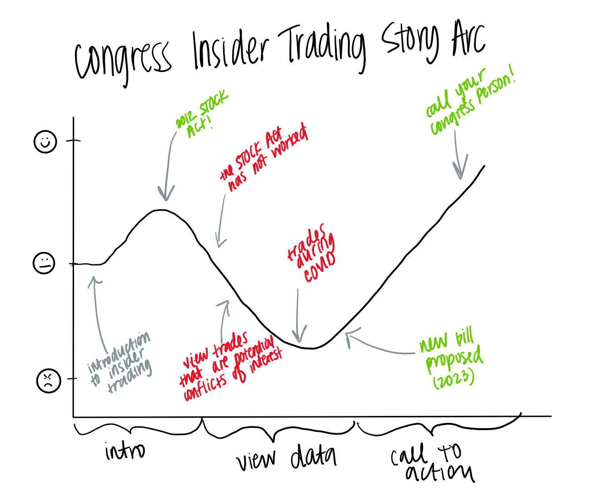
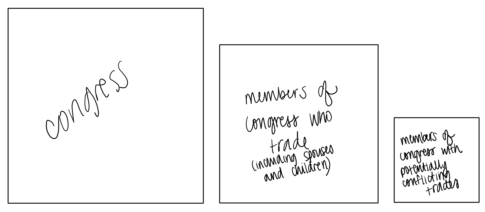
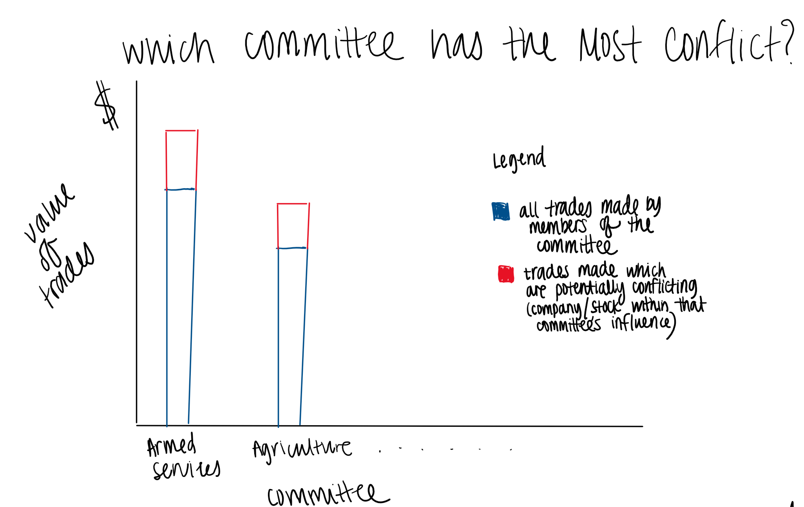
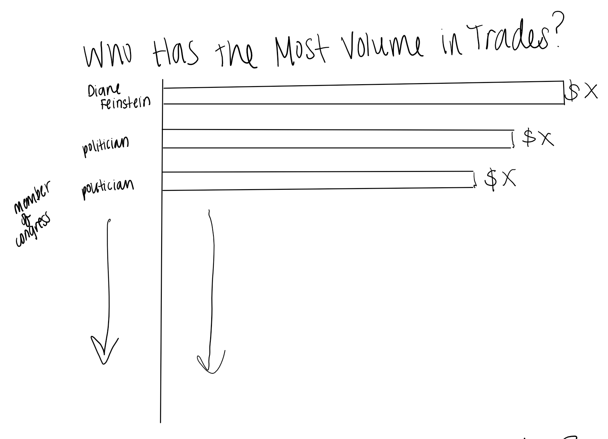
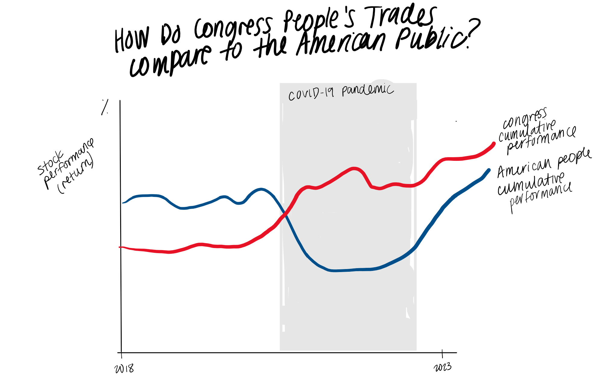

| [home page](https://bfriedel.github.io/portfolio/) | [visualizing debt](https://bfriedel.github.io/portfolio/visualizing-government-debt) | [critique by design](https://bfriedel.github.io/portfolio/critique-by-design) | [final project I](https://bfriedel.github.io/portfolio/final-project-part-one) | [final project II](https://bfriedel.github.io/portfolio/final-project-part-two)

# Outline
In 2012, Congress passed the Stop Trading on Congressional Knowledge (STOCK) Act, which required that members of Congress and the Executive Branch report stock trades above $1,000 made by themselves or family within 45 days of the trade[^1]. This act was designed to combat insider trading following heavy volumes of trades made by members of Congress which led to reports of insider trading[^2]. In the 10+ years since this Act has passed, it has widely been considered a failed effort[^3]. 

I am interested in showing how Congress People's stock trades conflict with the committees that they are on and how these trades have benefitted them by comparing their performance with that of the American Public. For around two years on Tik Tok, creators have established platforms on the basis of tracking Congress People's stock trades and highlighting certain trades that could potentially be conflicts of interest[^4]. Last year, the New York Times did an analysis on all trades within and found 97 members of Congress that have made potentially conflicting trades based on the committees that they are on[^5]. Since that article was published, there have been three separate bills proposed to ban stock trading by members of Congress, two of which have been shut down. The latest one was introduced in late July and it is uncertain whether it will make it to the floor for debate or voting. This bill would require Congress People, their spouses, and their dependent children to place their stocks into a blind trust or not trade altogether[^6]. Amid record low trust in the American government[^7] it is important that we increase our faith in our representatives. My call to action will be to urge people to call their congress people and express their support for the bill to stop Congress people from using insider information to increase theor own gains. 

[^1]: 112th Congress. "Public Law No: 112-105." Congress, n.d., https://www.congress.gov/112/plaws/publ105/PLAW-112publ105.htm.
[^2]: Wong, Scott. "Insider Trading Bill Heads to House." Politico, Politico, 10 Feb. 2012, https://www.politico.com/story/2012/02/insider-trading-bill-heads-to-house-072391.
[^3]: Caputo, Marsco, Payne. "The STOCK Act: The Failed Effort to top Insider Trading in Congress." Campaign Legal, 18 Feb. 2022. https://campaignlegal.org/update/stock-act-failed-effort-stop-insider-trading-congress
[^4]: Mak, Tim. "TikTokers Are Trading Stocks By Copying What Members Of Congress Do." NPR, 21 Sept. 2021. https://www.npr.org/2021/09/21/1039313011/tiktokers-are-trading-stocks-by-watching-what-members-of-congress-do
[^5]: Kelly, Playford, Parlapiano. "Stock Trades Reported by Nearly a Fifth of Congress Show Possible Conflicts." New York Times, 13 Sept. 2022. https://www.nytimes.com/interactive/2022/09/13/us/politics/congress-stock-trading-investigation.html#:~:text=Stock%20Trades%20Reported%20by%20Nearly%20a%20Fifth%20of%20Congress%20Show%20Possible%20Conflicts,-By%20Kate%20Kelly&text=A%20New%20York%20Times%20analysis,by%20their%20legislative%20committee%20work.
[^6]: Moorcraft, Bethan. "'Put the American public first': Senators introduce a bipartisan law to ban members of Congress and executive officials — including the president — from trading stocks." Yahoo!Finance, 21 Sept. 2023. https://finance.yahoo.com/news/put-american-public-first-senators-211500437.html
[^7]: Pew Research Center. "Public Trust in Government: 1958-2023." Pew Research Center, 19 Sept. 2023. https://www.pewresearch.org/politics/2023/09/19/public-trust-in-government-1958-2023/

## Project Structure
- Introduction to stocks and insider trading
- STOCK Act requirements
- Why the act has failed (it's hard to prove insider trading)
- View potentially conflicting trades by members of Congress
- View the values of these trades
- Congress stock performance versus American People stock performance (especially during COVID)
- Call to Action

# Initial sketches

Story Arc: 

Sketches:

With my sketches, I am intending to show the percent makeup of questionable trades made by Congress People and then compare their successes with those of the regular American population. I am considering the idea of doing an analysis by political party, but party affiliation is not the point of my story, so I will determine if this is necessary when I get feedback. To note, even though Congress People report if the trade was made by themselves, their partner, or their dependent children, I have elected to just use the Congress Person's name and will annotate % of trades made by them versus others.

# The data
Because the STOCK Act requires disclosure of trades, the data is publically accessible through the SEC. Many different websites have built their platforms off of scraping this publicly accessible information so the data is easily accessible in many different places. I plan on using two main sources, Capitol Trades and Quiver Quantitative, which report the same data except Quiver Quantitative reports the performance of the stock since the purchase or sale, and Capitol Trades also has information on the committees the congress people are on. I also have access to an API on congress committees from ProPublica as well as Open Secrets, which will help me connect the Congress People to their committees. I am planning to scrape the information I need of trades, or I could do a free trial of the Quiver Quantitvative site to download the transactions. Here is a table containing my sources and/or potential sources:

| Name | URL | Description |
|------|-----|-------------|
| Capitol Trades | https://www.capitoltrades.com/trades | Details of trades by politicians  |
| Quiver Quantitative  | https://www.quiverquant.com/congresstrading/    |  Details of trades by politicians (includes performance of the stock since purchase or sale) |
| Market Beat  |  https://www.marketbeat.com/congress-stock-trades/#following-congress-stock-trades   |   Details of trades by politicians (includes price of stock after trade)         |
| Smart Insider | https://www.smartinsider.com/politicians/  |  Details of trades by politicians |
| ProPublica | https://www.propublica.org/datastore/api/propublica-congress-api | API to get committees by member of Congress |
| Open Secrets | https://www.opensecrets.org/open-data/api-documentation | Many different APIs to get information on different committees |
|  Benzinga  |  https://www.benzinga.com/news/23/03/31521439/conflict-of-interest-congress-members-who-own-meta-goog-snap-shares-could-benefit-from-tiktok-ban   |   Anecdotal evidence of optential insider trading |

# Method and medium
I plan to scrape data using Scrapy (Python) and will use Python to make any API calls. I then plan to clean the data using Pandas on a Jupyter Notebook and export to CSV. From there, I will create visualizations using Tableau and/or Flourish and publish these visualizations and my write up to a Shorthand presentation. 
